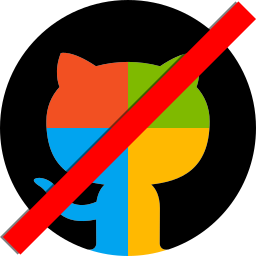

# Microsoft GitHub? No thanks. 

Microsoft announced on June 4th 2018 that they will acquire GitHub and
work together for a "bright future".

GitHub was a nice place for developers, but I'm sure Microsoft will find
a way to somehow destroy the biggest **free and independent** source
code hosting service in the world and infect it with it's own services
to just make everything worse.

Knowing how Microsoft wrecks down companies it acquired before, I moved
all my code away to [**GitLab**](https://gitlab.com/) instead of leaving
it on GitHub as if I didn't care what happens to it and also the
platform itself.

## So where is the code I'm looking for?
You can find the code for this repository
[**here**](https://gitlab.com/metaa/mixer-keyboard).
